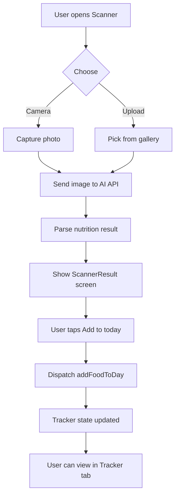
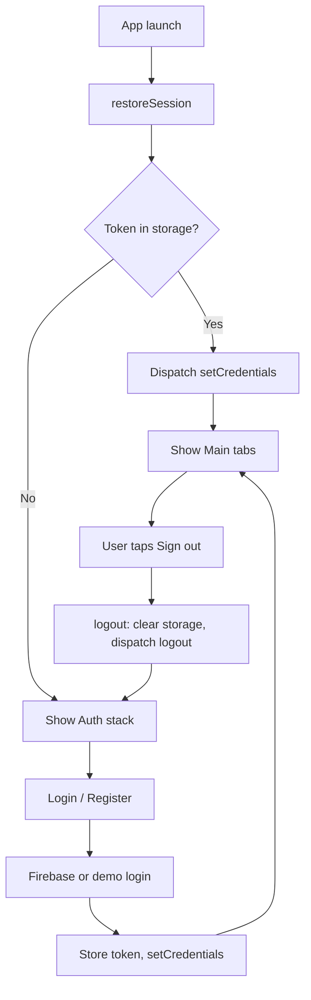

# CaloriePlus – Architecture & Diagrams

## 1. High-level architecture

```
┌─────────────────────────────────────────────────────────────────┐
│                        CaloriePlus App                           │
├─────────────────────────────────────────────────────────────────┤
│  Presentation (React Native)                                     │
│  ├── Screens (auth, scanner, tracker, diet)                      │
│  ├── Components (Button, Input, Card, CalorieChart, FoodItemRow) │
│  └── Navigation (Auth, Main Tabs, Stacks)                       │
├─────────────────────────────────────────────────────────────────┤
│  State (Redux Toolkit)                                           │
│  ├── authSlice    (user, token, isAuthenticated)                 │
│  ├── scannerSlice (lastScannedItem, isAnalyzing)                  │
│  ├── trackerSlice (today, history, goalCalories)                 │
│  └── dietSlice    (recommendations, currentPlan)                 │
├─────────────────────────────────────────────────────────────────┤
│  Services                                                        │
│  ├── api (Axios client)                                          │
│  ├── firebase (Auth)                                             │
│  ├── authService (login, register, restoreSession)               │
│  ├── nutritionService (analyzeFoodImage)                         │
│  └── dietService (getRecommendations, generateDietPlan)          │
├─────────────────────────────────────────────────────────────────┤
│  Utils / Config / Models                                         │
│  ├── date, storage, image                                        │
│  ├── env (from .env)                                             │
│  └── models (User, FoodItem, DailyIntake, DietPlan)              │
└─────────────────────────────────────────────────────────────────┘
```

## 2. UML – Component diagram (simplified)

```
+------------------+     +------------------+     +------------------+
|   LoginScreen    |     |  ScannerCamera   |     |  TrackerDaily    |
|   RegisterScreen |     |  ScannerUpload   |     |  TrackerHistory   |
|   ForgotPassword  |     |  ScannerResult   |     +------------------+
+--------+---------+     +--------+---------+              |
         |                        |                        |
         v                        v                        v
+--------+---------+     +--------+---------+     +--------+---------+
|   authSlice      |     |  scannerSlice   |     |  trackerSlice     |
|   dietSlice      |     |  (Redux Store)  |     |  dietSlice        |
+--------+---------+     +--------+---------+     +--------+---------+
         |                        |                        |
         v                        v                        v
+--------+---------+     +--------+---------+     +--------+---------+
| authService      |     | nutritionService|     |  dietService      |
| firebase         |     | api             |     |  api              |
+------------------+     +------------------+     +------------------+
```

## 3. Flowchart – User flow (scan food → add to tracker)



## 4. Flowchart – Auth flow



## 5. Folder structure (feature-based)

```
src/
├── assets/
├── components/       # Reusable UI
│   ├── common/       # Button, Input, Card
│   ├── CalorieChart.tsx
│   └── FoodItemRow.tsx
├── navigation/       # React Navigation
│   ├── types.ts
│   ├── AuthNavigator, MainTabNavigator
│   ├── ScannerNavigator, TrackerNavigator, DietNavigator
│   └── RootNavigator, index
├── screens/
│   ├── auth/         # Login, Register, ForgotPassword
│   ├── scanner/      # Camera, Upload, Result
│   ├── tracker/      # Daily, History
│   ├── diet/         # Recommendations, Plan, Generate
│   ├── HomeScreen, ProfileScreen
├── store/
│   ├── slices/       # auth, scanner, tracker, diet
│   ├── index.ts
│   └── hooks.ts
├── services/         # api, firebase, auth, nutrition, diet
├── hooks/            # useCachedNutrition, re-exports
├── utils/            # date, storage, image
├── constants/
├── theme/
├── models/
└── config/           # env
```

## 6. Data flow (Redux)

- **Unidirectional**: User action → dispatch → reducer updates state → selectors → UI re-renders.
- **Slices** own their state; no cross-slice mutations except via explicit actions or thunks if added later.
- **Services** are called from screens or thunks; they dispatch results (e.g. setCredentials, setScanResult).
